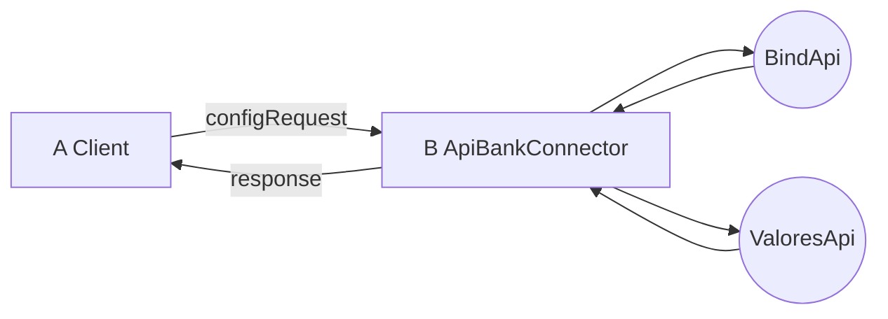

# UniversalAPIBankConnector
  
Api Bank Connector is a DLL to standardize access to the different ApiBanks. At the moment it has methods to access information from Banco Bind and Banco de Valores

## Available methods

**Bind**:

-   GetPersonByCUIT     
-   GetAccounts      
-   GetAccount      
-   GetMovements      
-   GetViewsByBankId  

**Valores**
-   GetMovement
-   GetAccounts      
-   GetAccount

##   How to use

``` r

# Create a ConfigRequest instance and assign it the parameters of the desired bank
ConfigRequest config = new ConfigRequest("http://ApiBankUrl", "UserName", "Password", BanksEnums.Bind);
# Create an instance of ApiBankConnector with configuration
ApiBankConnector _connector = new ApiBankConnector(config);
```


##   Example

``` r

# Create a ConfigRequest instance and assign it the parameters of the desired bank
ConfigRequest config = new ConfigRequest("http://ApiBankUrl", "UserName", "Password", BanksEnums.Bind);
# Create an instance of ApiBankConnector with configuration
ApiBankConnector _connector = new ApiBankConnector(config);
# Create Response
MovementsResponse reponse = new MovementsResponse();
# Create Request
MovementsRequest request = new MovementsRequest();
request.AccountId = "21-1-99999-4-6";
request.bank_id = "322";
request.view_id = "owner";
request.initialDate = "20/06/2019";
request.finalDate = "20/08/2019";
# Execute
reponse = _connector.GetMovements(request);
```
## Differences in Request

**GetMovements**

|Request Property|Banco Bind (Api Property)      |Bando de Valores (Api Property)|
|----------------|-------------------------------|-----------------------------|
|AccountId       |`AccountId`                    |`productNumber`              |
|bank_id         |`bank_id`                      |Ignore                       |
|view_id         |`view_id`                      |Ignore                       |
|initialDate     |`initialDate`                  |`initialDate`                |
|finalDate       |`finalDate`                    |`finalDate`                  |
|productId       |Ignore                         |`productId`                  |
|currencyId      |Ignore                         |`currencyId`                 |

**GetAccounts**

|Request Property|Banco Bind (Api Property)      |Bando de Valores (Api Property)|
|----------------|-------------------------------|-----------------------------|
|bank_id         |`bank_id`                      |Ignore                       |
|view_id         |`view_id`                      |Ignore                       |

## Diagrams


